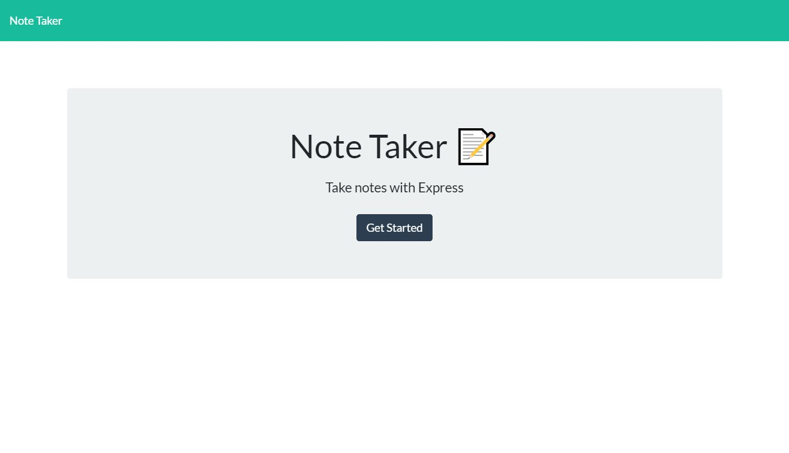

# Note Taker

## Table of Contents
* [Description](#description)
* [Built With](#built-with)
* [Installation](#installation)
* [Usage](#usage)
* [Screenshot](#screenshot)
* [Contributing](#contributing-to-note-taker)
* [Test](#test)
* [Questions](#questions)
* [License](#license)

## Description
This project is a Node.js application and Express.js server that runs a note taking application. You will have the ability to add, edit, and delete notes that will persist across sessions. The application currently only supports a single global user.

See a preview of this application in action [here]().

## Built With
- Node.js
- Express.js
- Bootstrap
- FontAwesome

## Installation
	git clone https://github.com/hsengu/note-taker.git
	cd ./note-taker
	npm install

## Usage
	npm start

## Screenshot

## Contributing to Note Taker
Please follow contribution guidelines at the [Contributor Covenant](https://www.contributor-covenant.org/version/2/1/code_of_conduct/) to contribute to Readme Generator.

## Tests
    This application was tested using Jest running under Ubuntu 20.04 LTS on WSL2. YMMV.
    Usage:
	    npm test

## Questions
Contact me at the following:
- [hsengu's GitHub Profile](https://github.com/hsengu)
- hok.s.uy@hsengu.com

## License
This project is licensed under GNU GPL v3
